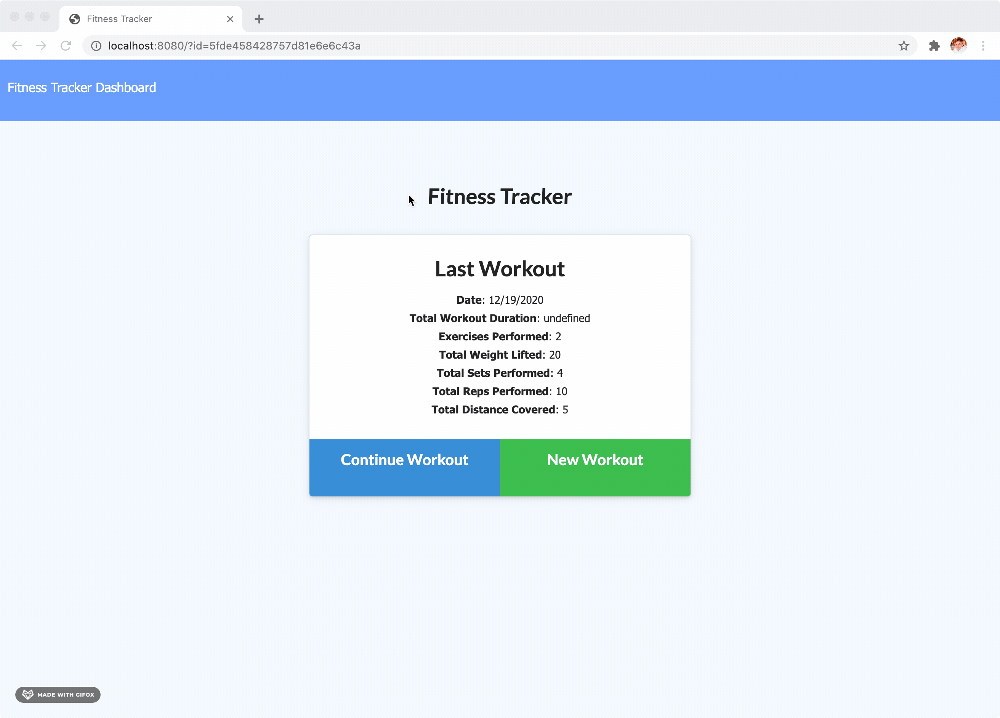

# Fitness Tracker

Fitness Tracker using a Mongo database with a Mongoose schema and handle routes with Express.

[Check out the deployed site here](https://secret-mesa-83729.herokuapp.com/)

## Table of Contents

- [User Story](#user-story)
- [Installation](#installation)

- [Links and Screenshots](#links-and-screenshots)

- [Created By](#created-by)

- [License](#license)

## User Story

Working out for so many people is a great way to release stress and better themselves. This application will allow users to keep track of their workouts and chart their progress. They can track cardio workouts and/or resistance training.

```
AS an individual, I enjoy spending workout and improving my fitness.
I WANT to be ablet to track my progress and see previous workouts.
SO I can continue improving my fitness with each session.
```

## Installation

To use this locally, first clone the repo in your terminal using the command below:

```
$ git clone https://github.com/neylonmc/FitnessTracker-.git
```

Once the repo is cloned, run the following command:

```
$ npm i
```

To run the server, run the following command in your terminal:

```
$ npm start
```

## Links and Screenshots

Repo: https://github.com/neylonmc/FitnessTracker-.git

Deployed App: https://secret-mesa-83729.herokuapp.com/

### UI


### Creating workout


### Dashbord



## Created by

- [Meaghan Neylon](https://github.com/neylonmc "Visit Meaghan's GitHub")

## License

[](https://opensource.org/licenses/MIT)
